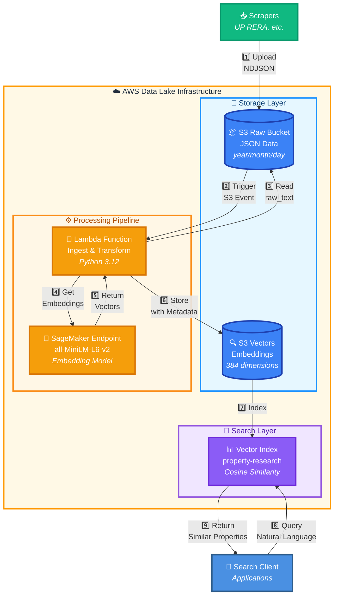

# Real Estate Data Lake

A centralized data platform for storing, processing, and searching real estate data using AWS services. Raw data from scrapers is automatically processed into vector embeddings for semantic search capabilities.

## What it Does

* **Stores** raw scraped data in S3 (partitioned by date)
* **Processes** JSON data automatically when uploaded
* **Generates** vector embeddings using AI/ML models
* **Indexes** vectors in S3 Vectors for fast semantic search
* **Enables** intelligent property searches using natural language

---

## Architecture



**Key Components:**
- **S3 Raw Bucket**: Stores scraped JSON data with date partitioning
- **Lambda Function**: Processes uploads, generates embeddings, stores vectors
- **SageMaker Endpoint**: Hosts sentence-transformers model for embeddings
- **S3 Vectors**: Vector database for fast similarity search
- **Vector Index**: Organizes vectors with cosine similarity metric

---

## Data Flow

1. **Scraper uploads** NDJSON file to S3 Raw bucket (e.g., `s3://bucket/prefix/year=2025/month=11/day=16/data.json`)
2. **S3 event triggers** Lambda function automatically
3. **Lambda reads** each record's `raw_text` field
4. **SageMaker generates** 384-dimensional vector embeddings
5. **Lambda stores** vectors in S3 Vectors with metadata
6. **Vector index** makes data searchable by semantic similarity
7. **Applications query** using natural language (e.g., "residential apartments in Noida")
8. **System returns** most similar properties based on vector distance

---

## Infrastructure Setup

### Prerequisites

- **Terraform** - Infrastructure as code tool
- **AWS CLI** - Configured with credentials (`aws sts get-caller-identity` should work)
- **Python 3.12+** and **uv** - For Lambda packaging
- **AWS Account** - With permissions to create S3, Lambda, SageMaker, IAM resources

### Quick Start

1. **Navigate to infrastructure directory:**
   ```sh
   cd infra-as-code
   ```

2. **Set up environment variables:**
   ```sh
   export AWS_PROFILE=your-aws-profile
   export AWS_REGION=us-east-1
   ```

3. **Initialize Terraform:**
   ```sh
   ./tf-wrapper.sh dev datalake init
   ```

4. **Review planned changes:**
   ```sh
   ./tf-wrapper.sh dev datalake plan
   ```

5. **Apply infrastructure:**
   ```sh
   ./tf-wrapper.sh dev datalake apply
   ```

6. **Get outputs:**
   ```sh
   ./tf-wrapper.sh dev datalake output
   ```

### What Gets Created

The Terraform configuration will create:

1. **S3 Raw Bucket** - For storing scraped data
   - Bucket name: `{account-id}-{region}-{env}-datalake-raw`
   - Versioning: Enabled
   - Encryption: SSE-S3

2. **SageMaker Endpoint** - For embedding generation
   - Model: `sentence-transformers/all-MiniLM-L6-v2`
   - Instance: `ml.t2.medium`
   - Dimension: 384

3. **S3 Vector Bucket** - For vector storage (created via AWS CLI)
   - Bucket name: `{account-id}-{region}-{env}-datalake-vectors`
   - Index name: `property-research`
   - Distance metric: Cosine

4. **Lambda Function** - For data ingestion
   - Runtime: Python 3.12
   - Memory: 1024 MB
   - Timeout: 300 seconds
   - Parallel workers: 10

5. **IAM Roles & Policies**
   - Lambda execution role
   - S3 access (read raw, write vectors)
   - SageMaker invoke permissions
   - S3 Vectors permissions

### Configuration Files

```
tf-vars/
└── dev/
    ├── params-env.tfvars          # Environment-wide settings
    └── datalake/
        └── param-component.tfvars  # Component-specific settings
```

---

## Usage Examples

### Upload Data

Scrapers automatically upload to the raw bucket:
```sh
aws s3 cp data.json \
  s3://{account-id}-{region}-dev-datalake-raw/scrapers/up-rera/year=2025/month=11/day=16/
```

### Search Vectors

Use the test search script:
```sh
cd infra-as-code/tf-modules/ingest-lambda/lambda
uv run test_search_s3vectors.py
```

Example query:
```python
query = "3 bedroom apartments in Noida under construction"
# Returns similar properties based on vector similarity
```

---

## Cost Considerations

**Monthly Estimates (Development):**

- **S3 Raw**: ~$0.023/GB stored + $0.0004/1000 PUT requests
- **SageMaker**: ~$30-50/month (ml.t2.medium, always on)
- **Lambda**: ~$0.20/1M invocations + compute time (usually under free tier)
- **S3 Vectors**: ~$0.025/GB stored + $0.002/1000 vector operations
- **Data Transfer**: Usually minimal within same region

**Total**: ~$30-60/month for dev environment with moderate usage

**Cost Optimization Tips:**
- Delete old SageMaker endpoints when not in use
- Use S3 lifecycle policies for old raw data
- Monitor Lambda concurrency limits
- Enable S3 Intelligent-Tiering for infrequent access

---

## Monitoring & Debugging

### Check Lambda Logs

```sh
aws logs tail /aws/lambda/{env}-datalake-ingest-lambda --follow
```

### Test SageMaker Endpoint

```sh
aws sagemaker-runtime invoke-endpoint \
  --endpoint-name {endpoint-name} \
  --body '{"inputs": "Sample text"}' \
  --content-type application/json \
  output.json
```

### View S3 Vectors

```sh
aws s3-vectors list-vector-indexes \
  --bucket-name {bucket-name}
```

### Check Processing Status

Monitor Lambda metrics in CloudWatch:
- Invocations
- Duration
- Errors
- Throttles

---

## Troubleshooting

### Lambda Timeout

**Issue**: Lambda times out processing large files

**Solution**: 
- Increase timeout in `4-ingest-lambda.tf`
- Increase `MAX_WORKERS` environment variable
- Process smaller batches

### SageMaker Endpoint Not Found

**Issue**: Lambda can't invoke SageMaker endpoint

**Solution**:
- Check endpoint status: `aws sagemaker describe-endpoint --endpoint-name {name}`
- Verify region matches Lambda region
- Wait for endpoint to be "InService"

### S3 Vectors Permission Denied

**Issue**: Lambda can't write to S3 Vectors

**Solution**:
- Verify bucket and index exist
- Check IAM policy includes `s3vectors:PutVectors`
- Ensure region is correct in boto3 client

### No Vectors Generated

**Issue**: Data uploaded but no vectors in S3 Vectors

**Solution**:
- Check Lambda logs for errors
- Verify `raw_text` field exists in JSON
- Test SageMaker endpoint manually
- Check retry logic in Lambda

---

## Cleanup

To remove all infrastructure:

```sh
# Destroy resources
./tf-wrapper.sh dev datalake destroy

# Note: S3 Vector bucket must be deleted manually via AWS CLI
aws s3-vectors delete-vector-index \
  --bucket-name {bucket-name} \
  --index-name property-research

aws s3-vectors delete-bucket \
  --bucket-name {bucket-name} \
  --region {region}
```

---

## Project Structure

```
real-estate-datalake/
├── README.md                           # This file
└── infra-as-code/
    ├── tf-wrapper.sh                   # Terraform helper script
    ├── tf-real-estate-datalake/        # Main infrastructure
    │   ├── 1-data-acquisition-s3.tf    # Raw S3 bucket
    │   ├── 2-sagemaker-embedding-model.tf # ML model endpoint
    │   ├── 3-s3-vectors.tf             # Vector storage
    │   ├── 4-ingest-lambda.tf          # Processing function
    │   ├── commons.tf                  # Shared locals
    │   ├── providers.tf                # AWS provider config
    │   ├── variable.tf                 # Input variables
    │   └── outputs.tf                  # Output values
    ├── tf-modules/                     # Reusable modules
    │   ├── s3/                         # S3 bucket module
    │   ├── sagemaker/                  # SageMaker module
    │   └── ingest-lambda/              # Lambda module
    │       ├── main.tf                 # Lambda resources
    │       └── lambda/                 # Lambda code
    │           ├── ingest.py           # Main handler
    │           ├── package.py          # Build script
    │           ├── pyproject.toml      # Dependencies
    │           └── test_search_s3vectors.py # Search test
    └── tf-vars/                        # Environment configs
        └── dev/
            ├── params-env.tfvars       # Dev environment
            └── datalake/
                └── param-component.tfvars
```

---

## Next Steps

1. **Deploy Infrastructure**: Follow the Quick Start guide above
2. **Connect Scrapers**: Configure scrapers to upload to raw bucket
3. **Test Search**: Run test script to verify end-to-end flow
4. **Build Applications**: Use vector search in your applications
5. **Monitor Costs**: Set up CloudWatch billing alerts

---

## Contributing

For questions or improvements, please open an issue in the repository.

---

## License

See repository root for license information.
